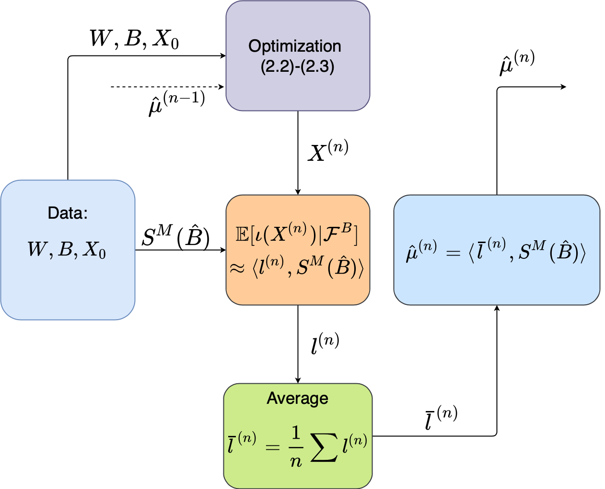

# SigDFP
Signatured Deep Fictitious Play for Mean Field Games with Common Noises

<p align="center">
  
</p>

## Installment
```
# need signature package
pip install -r requirements.txt
```
## Experiments
We have three experiments: SystemicRisk, Invest, InvestConsumption. To train model for examples, use the following code with corresponding case name and signature depth. For example, training SystemicRisk example with signature depth 2, run
```
python3 run.py --case SystemicRisk --depth 2
```


## Plots
Plots can be done by
```
python3 SystemicRiskPlot.py --depth 2
python3 InvestPlot.py --depth 2
python3 InvestConsumpPlot.py --depth 4
```
The depth should be the same as the depth for training.

## Citation

This code is for the paper "Signatured Deep Fictitious Play for Mean Field Games with Common Noise", if you find this useful in your research project, please cite
```
@article{min2021sigdfp,
  title={Signatured Deep Fictitious Play for Mean Field Games with Common Noise},
  author={Min, Ming and Hu, Ruimeng},
  journal={International Conference on Machine Learning},
  year={2021}
}
```
